# MVP demonstration — SIA 4010 Test 1, Case 600

## What this MVP demonstrates

The Model Builder creates a deterministic one-zone Case 600 model entirely
through VEScripts. It generates and checks:

- the 8 m × 6 m × 2.7 m test cell;
- two 3 m × 2 m south windows;
- the lightweight BESTEST wall, roof and raised floor;
- clear double glazing;
- constant 0.5 ACH infiltration;
- 200 W constant equipment gain;
- zero people and zero lighting gains;
- ideal heating at 20 °C and cooling at 27 °C;
- project-local JSON inputs, gbXML geometry and audit artifacts.

This is a **provisional validation demonstration**, not yet a normative
SIA 4010 conformity claim. Public BESTEST values remain tagged
`PUBLIC_REFERENCE`.

```mermaid
flowchart LR
    UI["VEScripts Model Builder"] --> B["Case 600 bundle + evidence tiers"]
    B --> P["Fail-closed preflight"]
    P --> G["gbXML geometry + VE assets"]
    G --> V["VE read-back validation"]
    V --> S["ApacheSim"]
    S --> A["APS binding and extraction"]
    A --> C["SIA expected-results comparator"]
    C --> R["Audit and demonstration report"]
```

## Before the demonstration

1. Create a new disposable VE project and save it in a permanent folder.
2. Keep a backup of that folder.
3. Put exactly one client-supplied Denver DRYCOLD weather candidate in the
   project root. Supported suffixes are `.epw`, `.fwt` and `.tmy`.
4. Do not put two weather files in the root: ambiguity is a hard failure.
5. Open VEScripts from that saved project.

## Demonstration sequence

1. Run `Run_VE_SIA_Model_Builder_UI.py`.
2. Select:
   - profile: `SIA4010_OFFICIAL`;
   - class: `1A`;
   - variant: `test_1`;
   - case: `600`.
3. Click **Préparer et contrôler**.
4. Open `sia4010_case600_mvp_audit.json` in the VE project root.
5. Confirm:
   - status is `READY_FOR_PROVISIONAL_DEMONSTRATION`;
   - weather path and SHA-256 are present;
   - `compliance_claim_allowed` is `false`;
   - the three public-reference inputs are listed.
6. Click **Créer dans VE** and confirm the mutation.
7. Review the workflow JSON report before running ApacheSim.
8. Run ApacheSim for the required annual period.
9. Run `Run_VE_SIA4010_APS_Probe.py`.
10. Run `Run_VE_SIA4010_Tests.py` only after the APS bindings and official
    expected-result cells have been reviewed.

## Expected decision states

| Status | Meaning | Action |
|---|---|---|
| `BLOCKED_WEATHER` | No unique usable weather file was found | Add exactly one client weather file |
| `READY_FOR_PROVISIONAL_DEMONSTRATION` | Inputs are executable, but some are public references | Demonstrate, do not claim normative conformity |
| `READY_FOR_PROVISIONAL_VE_MUTATION` | The strict creation preflight passed | VE creation is permitted with warnings |
| `READY_FOR_VE_MUTATION` | All inputs have controlled normative evidence | Reserved for the post-review release |
| `FAIL` / `BLOCKED_*` | A consistency or evidence control failed | Stop and use the audit detail |

## Evidence to show a manager

- `sia4010_case600_mvp_audit.json`;
- `sia4010_case_manifest.json`;
- `reference_model_config.json`;
- `reference_model_assets.json`;
- `sia_model_scenario.json`;
- `sia4010_artifacts/model_builder/SIA4010_1A_600_preflight.json`;
- generated gbXML and geometry JSON;
- reference-model validation report;
- APS probe and comparison report after simulation.

## Known gaps for the end-of-week review

1. **Normative identity** — public BESTEST inputs have not yet been
   line-by-line confirmed against ISO 52016-1:2017 Chapter 7.
2. **Weather identity** — a checksum proves which file was used, not that it is
   the exact required DRYCOLD dataset. Client provenance must be recorded.
3. **Glazing runtime behavior** — VE must read back U = 3.0 W/(m²·K) and
   g = 0.789. A controlled VE calibration may still be required.
4. **Results bindings** — APS variable names must be bound and reviewed against
   the exact installed VE version.
5. **Acceptance limits** — official expected-result cells and tolerances must
   come from the supplied SIA workbooks; a public BESTEST range must never
   silently replace them.
6. **Scope** — this milestone proves Test 1 / Case 600. Other cases and the
   complete 1A class remain separate release increments.

## Definition of done for this MVP

The MVP is complete when one clean disposable project can repeat the full
sequence without manual model editing, all validation controls are
machine-readable, simulation outputs are extractable, and every unresolved or
provisional item remains visible in the audit and presentation.
