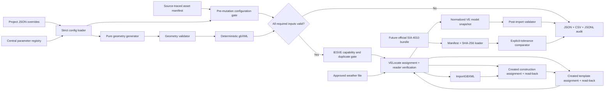

# Swiss compliance-ready reference VE model architecture

## 1. Outcome and claim boundary

This implementation creates a deterministic reference-building geometry and, in `create` mode, provisions source-traced materials, layered constructions, profiles, gains, air exchanges and a new thermal template before importing and completing the model in the active IESVE project.

It is deliberately **compliance-ready**, not **compliance-assumed**:

- SIA 380/2 reference-project values are retained only as comparison inputs.
- Project U-values, glazing data, ventilation, occupancy, gains, thermal bridges and climate decisions are independent source-traced parameters.
- SIA 2024, SIA 2028, SIA 387/4 and project-specific values are not reconstructed from memory.
- SIA 4010 results remain `NOT_CHECKABLE` until official files and acceptance tolerances are admitted through a checksum-verified bundle.
- A generated report is evidence of workflow/readiness state, not an SIA certificate.

## 2. Critical IESVE API boundary

The bundled VE 2023 VEScript API exposes model/body/surface inspection, gbXML import, construction/material creation and assignment, template editing/assignment, weather assignment and adjacency rebuilding. It does not document a room-solid creation primitive or `VEProject.create_thermal_template`. The official VE 2025 API does document `create_profile`, `create_casual_gain`, `create_air_exchange`, `create_thermal_template` and `create_apache_system` on `VEProject`.

The architecture therefore uses this supported boundary:

1. Create exact geometry as pure Python domain objects.
2. Validate the geometry before any VE mutation.
3. Serialize a deterministic gbXML file.
4. Import it with `ImportGBXML.import_file`.
5. In `create` mode, load and checksum the source-traced asset manifest.
6. Create and read back profiles, materials, layered constructions, gains and air exchanges.
7. Create the new generic thermal template, apply its data and read it back.
8. Assign and immediately verify the created CDB constructions and template.
9. Assign and verify the weather file through `VELocate` and `WeatherFileReader`.
10. Re-extract the model into a normalized snapshot and run full post-import validation.

This is still a VEScript-controlled, no-manual-edit workflow. It avoids claiming a native geometry-creation feature that the documented API does not provide.

## 3. Folder architecture

```text
IES-Intership-general-repo/
|-- Run_VE_Swiss_Reference_Model.py
|-- config/
|   |-- reference_model.example.json
|   `-- reference_model_assets.example.json
|-- schemas/
|   |-- reference_model.config.schema.json
|   `-- reference_model.assets.schema.json
|-- scripts/
|   `-- reference_model_dry_run.py
|-- swiss_sia/
|   `-- reference_model/
|       |-- __init__.py
|       |-- asset_manifest.py
|       |-- compliance_config.py
|       |-- config_loader.py
|       |-- domain.py
|       |-- exceptions.py
|       |-- gbxml_writer.py
|       |-- geometry.py
|       |-- logging_config.py
|       |-- report_generator.py
|       |-- results.py
|       |-- source_register.py
|       |-- validator.py
|       |-- ve_api.py
|       |-- ve_asset_provisioner.py
|       |-- workflow.py
|       `-- sia4010/
|           |-- __init__.py
|           |-- test_runner.py
|           |-- test_loader.py
|           |-- expected_results.py
|           `-- compliance_comparator.py
`-- tests/
    |-- test_reference_model_config.py
    |-- test_reference_model_asset_provisioning.py
    |-- test_reference_model_geometry.py
    |-- test_reference_model_reporting_and_workflow.py
    `-- test_sia4010_future_hooks.py
```

Runtime artifacts are written under the active VE project:

```text
reference_model_artifacts/
|-- geometry/swiss_reference_model.gbxml
|-- logs/reference_model.log
`-- reports/
    |-- reference_model_report.json
    |-- reference_model_audit.jsonl
    `-- excel_ready/
        |-- parameters.csv
        |-- validation_results.csv
        |-- spaces.csv
        |-- surfaces.csv
        |-- openings.csv
        |-- constructions.csv
        `-- thermal_templates.csv
```

## 4. Module responsibilities

| Module | Responsibility | Design boundary |
|---|---|---|
| `compliance_config.py` | Defines every model/compliance parameter with name, category, description, units, source, source locator and validation range. | Geometry defaults are explicitly non-regulatory; missing compliance inputs remain placeholders. |
| `config_loader.py` | Applies strict JSON overrides. | Unknown fields fail. A populated compliance value must replace placeholder provenance with a real source. |
| `asset_manifest.py` | Loads and validates the source-traced project asset package. | Every physical/operational field has description, units, source, locator and range; unknown fields and placeholders fail. |
| `domain.py` | Immutable points, polygons, spaces, surfaces, openings and normalized VE snapshots. | Contains no IESVE dependency. |
| `geometry.py` | Generates the reference zoning, envelope, openings and shades. | Contains no regulatory values and no VE API calls. |
| `gbxml_writer.py` | Serializes the domain model to deterministic gbXML. | Embeds geometry only; thermal/compliance values are not smuggled into the exchange file. |
| `ve_api.py` | Capability gate and all IESVE mutations/extractions. | Lazy `iesve` import; pure modules remain testable outside VE. |
| `ve_asset_provisioner.py` | Creates profiles, CDB materials/constructions, gains, air exchanges, optional Apache system and thermal template. | Dependency-ordered creation, enum compatibility layer and immediate read-back for every setter. |
| `validator.py` | Runs configuration, geometry and VE snapshot controls. | Stable control IDs and `PASS`/`WARNING`/`FAIL` only. |
| `report_generator.py` | Creates canonical JSON, CSV tables and JSONL audit. | Stable filenames and atomic replacement prevent partial report files. |
| `workflow.py` | Coordinates gates, mutation order, immediate checks and final reporting. | No mutation occurs after a failed preflight. |
| `source_register.py` | Records page-level local source locations and external schema authority. | Source metadata is carried into every JSON report. |
| `sia4010/*` | Future official bundle loading and comparison. | Checksums and explicit source tolerances are mandatory. |
| `Run_VE_Swiss_Reference_Model.py` | IESVE Run-button entry point. | No `argparse`, GUI interaction or hard-coded project path. |

## 5. Reference geometry

The default reference geometry is a one-storey orthogonal 2-by-2 zone grid. The dimensions are central configuration values and are labeled as non-regulatory assumptions.

Default object inventory:

- 4 thermal spaces/zones;
- 8 external wall segments;
- 4 shared internal partition surfaces;
- 4 roof surfaces;
- 4 slab-on-grade surfaces;
- 8 windows;
- 1 external door;
- 8 independent overhang/shade surfaces.

The generator uses positive X east, positive Y north and positive Z up. Every room has six outward-oriented shell polygons. Shared partitions have two adjacent space references. Envelope surfaces have one. Shade surfaces have none.

The pure geometry validator checks:

- unique IDs;
- positive areas and volumes;
- pairwise non-overlapping room interiors;
- six-face room shells;
- exactly six thermal boundary references per room;
- correct adjacency cardinality;
- opening coplanarity and containment;
- no opening overlap;
- positive opaque remainder after openings;
- explicit construction mapping for every thermal surface/opening;
- presence of all required object types.

## 6. Configuration model

The registry contains these categories:

- Building Parameters
- Envelope Parameters
- Window Parameters
- Climate Parameters
- Ventilation Parameters
- Occupancy Parameters
- Internal Gains Parameters
- Thermal Bridge Parameters
- Thermal Template Parameters
- HVAC Placeholder Parameters
- Placeholder Regulatory Parameters

The JSON override syntax is:

```json
{
  "schema_version": "1.0",
  "parameters": {
    "weather_file": {
      "value": "C:/approved/weather/file.fwt",
      "source": "Approved project climate decision",
      "source_locator": "CLIMATE-DECISION-001"
    }
  }
}
```

For compliance-relevant values, scalar shorthand is intentionally rejected while the parameter still has placeholder provenance. The source and locator must be supplied with the value.

In `existing` mode, inputs required before VE mutation are:

- external wall CDB construction ID;
- roof CDB construction ID;
- ground-floor CDB construction ID;
- internal partition CDB construction ID;
- door CDB construction ID;
- glazing CDB construction ID;
- approved weather file;
- exact existing approved thermal-template name;
- thermal-template source/checksum record.

In `create` mode, the six construction IDs plus the template name/checksum are planned runtime outputs. The required inputs are an approved weather file and a valid `reference_model_assets.json`. The manifest must define all material physics, layer thicknesses, optical values, profile data, gains, air exchanges and template conditions with provenance. No lightweight or guessed construction is synthesized.

## 7. VEScript workflow

1. Obtain the active project and real model (`models[0]`).
2. Load `<active-project>/reference_model_config.json`, or the fail-closed defaults if absent.
3. If create mode is selected, load, checksum and validate `reference_model_assets.json`.
4. Validate configuration metadata, values, required inputs and planned runtime identifiers.
5. Generate and validate the pure geometry.
6. Write the gbXML artifact even when the mutation gate is blocked, so geometry can be inspected independently.
7. Stop and report if any preflight control is `FAIL`.
8. Verify required VE API capabilities.
9. Refuse to run if any expected generated room name already exists. No destructive replacement is attempted.
10. In create mode, reject existing template/profile names before creating assets.
11. Create profiles and persist them with `save_profiles`.
12. Create CDB materials, constructions and ordered layers; read every property back.
13. Optionally create the approved simplified Apache system.
14. Create gains and air exchanges, resolving logical profile references to runtime IDs.
15. Create the thermal template, set conditions/system data, attach gains/exchanges and call `apply_changes`.
16. Convert created IDs and the manifest SHA-256 into source-traced runtime configuration overrides.
17. Import the generated gbXML and validate imported rooms.
18. Assign each surface/opening construction and read it back.
19. Rebuild model adjacencies.
20. Assign the newly created template to all generated rooms and read assignments back.
21. Assign weather with `VELocate`; verify it with both `VELocate.get()` and `WeatherFileReader`.
22. Extract the full normalized snapshot, run all controls and emit reports.

## 8. Data flow



## 9. Validation strategy and controls

| Control family | What it proves | Failure behavior |
|---|---|---|
| `CFG-*` | Parameter metadata, ranges, required inputs and unresolved placeholders. | Required missing inputs block all VE mutation. Optional unknown compliance values remain warnings. |
| `GEO-*` | Pure geometry consistency and object completeness. | Any geometry failure blocks import. |
| `VE-ZONE-*` | Imported room presence, uniqueness, areas, volumes and non-orphan state. | Stops before assignments if imported rooms are invalid. |
| `VE-CON-*` | Configured CDB constructions exist and contain defined layers/material references. | Assignment is blocked/fails. |
| `VE-ENV-*` | Every thermal surface/opening has a construction and valid basic properties. | Final status is `FAIL`. |
| `VE-TPL-*` | Exact template existence/assignment and structural content. | Missing conditions/system data fail; missing gains/air exchange require warning/evidence. |
| `VE-WEA-*` | Weather assignment and file readability. | Final status is `FAIL`. |
| `VE-THERM-*` | Declared project thermal/optical values agree with CDB values within software QA tolerance. | Mismatch fails; unresolved declared value warns. QA tolerance is explicitly not a regulatory tolerance. |
| `VE-HVAC-*` | Exact system assignment when configured. | Missing placeholder warns; configured mismatch fails. |
| `RUN-*` | Workflow execution failures and dry-run limits. | Always appears in audit/report. |

The overall status is the worst individual status: `FAIL` outranks `WARNING`, which outranks `PASS`.

## 10. Reporting contract

`reference_model_report.json` contains:

- run/project/API metadata;
- complete parameter registry;
- all placeholder parameters;
- source register;
- generated geometry and assumptions;
- normalized VE snapshot;
- every validation result;
- every workflow audit event;
- claim guardrail.

The CSV tables are denormalized views for Excel/Power Query. The JSONL file is the machine-readable chronological audit stream. Reports use stable filenames so downstream automation does not need to discover timestamps. Each write uses a temporary file followed by atomic replacement.

## 11. Future SIA 4010 integration

The SIA 4010 guide states that detailed test documents, example-building data and evaluation workbooks are separate official artifacts. The core architecture therefore has no embedded expected results.

The future bundle contract is:

```text
sia4010_official_bundle/
|-- official_manifest.json
|-- official_test_specifications/...
|-- official_example_models/...
|-- official_evaluation_workbooks/...
`-- normalized_expected_results.csv
```

`official_manifest.json` must provide:

- schema version;
- issuing authority;
- official source URL;
- each file's relative path;
- each file's role;
- applicable test IDs;
- SHA-256 checksum.

`test_loader.py` rejects missing, path-traversing or checksum-mismatched files. `expected_results.py` defines a normalized result key. `compliance_comparator.py` compares only equal units and only where the admitted source provides an absolute and/or relative tolerance. Otherwise the outcome is `NOT_CHECKABLE`. `test_runner.py` orchestrates the boundary without changing geometry, VE extraction or reporting code.

## 12. Missing regulatory/project information

| Missing input | Why it is not invented | Current behavior | Source/evidence needed |
|---|---|---|---|
| SIA 2024 use-category mapping | Depends on actual room use and licensed table data. | Placeholder warning. | Approved room-use schedule and SIA 2024 mapping. |
| Occupancy density and schedules | Category/project dependent. | Placeholder warning; template evidence required. | SIA 2024/project usage evidence and VE profile IDs. |
| People, lighting and equipment gains | Depends on SIA 180, SIA 2024, SIA 387/4 and design data. | Placeholder warning. | Source-traced gain schedules and radiant/latent fractions. |
| Ventilation and infiltration assumptions | Depends on use, system design, area basis and airtightness evidence. | Placeholder warning. | Approved ventilation/airtightness calculations. |
| Solar-protection type and control | Depends on product and SIA 387/4 strategy mapping. | Geometry is shade-capable; control remains placeholder. | Product data, g-total basis, control schedule and mapping. |
| Thermal bridge coefficients | Project detail dependent and linked to SIA 380 methodology. | Placeholder warning. | Psi/chi calculations or approved aggregate evidence. |
| Approved material/layer definitions | Thermal mass and material physics cannot be inferred from U-value alone. | Create mode blocks until every material/layer field is sourced and valid. | Approved calculations, product data and manifest checksum. |
| Ground-contact method/data | U-value depends on geometry and declared method. | Project value remains placeholder. | SIA 380 method inputs and calculation evidence. |
| Weather station/dataset/scenario | Location and assessment case dependent. | Exact weather file required; metadata remains traceable placeholders. | SIA 2028/project climate decision and file checksum. |
| Approved thermal-template contents | Usage values remain unknown until supplied, even though VE 2025 can create the object. | Create mode requires source-traced profiles, conditions, gains and exchanges. | Completed asset manifest, checksum and independent review record. |
| HVAC topology/performance | System design is outside the geometry baseline and SIA checks are capacity/class dependent. | Explicit optional placeholder. | Approved Apache System/ApacheHVAC design and ID. |
| Official SIA 4010 test files | Published separately from the guide. | `NOT_CHECKABLE`; no expected result or tolerance embedded. | Official specifications, models, workbooks and validation scope. |
| Target SIA 4010 class | Product/use-scope decision. | Placeholder. | Agreed class (1A, 1B, 2A, 2B, 3, 4A, 4B or 5). |

## 13. Risk assessment

| Risk | Impact | Mitigation in architecture | Residual action |
|---|---|---|---|
| Installed VE API differs from VE 2023 documentation | Import/assignment call can fail. | Capability gate, lazy adapter, controlled exception and audit report. | Run the extraction/capability probe in every supported VE release and maintain a version matrix. |
| gbXML importer interprets a schema/profile differently | Missing/altered rooms, openings or shades. | Configurable gbXML version, deterministic IDs, immediate imported-room validation and final object snapshot. | Execute import tests in target VE versions and validate against an official gbXML XSD plus a saved VE fixture. |
| Created IDs differ between projects | Static IDs would not be portable. | Provisioning receipt injects actual runtime IDs into the immutable configuration before assignment. | Qualify ID/read-back behavior in every supported VE release. |
| Template/profile name collision | VE may append a suffix and create duplicates. | `on_existing='fail'` and pre-creation collision checks. | Start from a clean project after any partial failed run. |
| Partial VE mutation after a late failure | Active project may contain imported rooms. | Duplicate fail-closed behavior prevents accidental second import; reports identify exact last completed stage. | Add pre-mutation project archive and tested restore procedure before production release. |
| Model geometry passes pure checks but VE healing modifies it | Performance model diverges from contract. | Post-import room/surface/opening snapshot and object counts. | Add coordinate-level VE-vs-gbXML comparison when the API exposes vertices reliably. |
| Component reference values are mistaken for whole-building compliance limits | False claim/certification risk. | `comparison_only` parameter flag and explicit claim guardrails. | Independent Swiss compliance expert review and certification governance. |
| Official SIA 4010 formats change | Loader cannot read them. | Adapter boundary, manifest versioning and normalized result contract. | Implement format-specific loaders without changing comparator/core. |
| Unsupported replacement/deletion | Duplicate/overlap risk. | Existing generated room names block mutation; no destructive cleanup. | Use a fresh project or tested project-template workflow for each generation. |

## 14. Implementation and release phases

### Phase 0 - architecture, pure-Python baseline and create-mode provisioning (implemented)

- Central parameter registry and strict JSON overrides.
- Deterministic geometry and gbXML generation.
- Geometry validation.
- IESVE runtime boundary.
- Post-import snapshot validation.
- JSON/CSV/JSONL reporting.
- Future SIA 4010 loader/comparator interfaces.
- Source-traced asset manifest and JSON schema.
- Capability-gated profile/material/construction/gain/air-exchange/template creation.
- Runtime identifier receipt and read-back verification.
- Unit tests outside VE.

### Phase 1 - target VE runtime qualification

1. Run the launcher in each supported VE release.
2. Record capability probe results and exact enum/method behavior.
3. Import the reference gbXML and compare expected versus VE object counts.
4. Confirm shade-body and opening classifications.
5. Confirm VELocate accepts absolute and VE-resolvable paths.
6. Confirm ISO U-factor extraction and glazing property keys.
7. Add recorded/approved runtime fixtures to tests.

Exit gate: zero uncharacterized VE API calls and a documented support matrix.

### Phase 2 - authoritative input package

1. Obtain licensed SIA 2024/SIA 2028/SIA 387/4 inputs and project decisions.
2. Complete the material, construction and glazing definitions in the asset manifest.
3. Complete and independently review profiles, gains, air exchanges and template fields.
4. Store checksums and source records in the project evidence register.
5. Complete weather-file provenance and checksum.
6. Run model generation in a clean VE project and close all `FAIL` controls.

Exit gate: generated model has no missing required data, no construction/template/weather errors and only deliberately accepted warnings.

### Phase 3 - simulation and SIA 380/2 result evidence

1. Add simulation options/calendar/timestep configuration after source confirmation.
2. Run ApacheSim through the existing API.
3. Extract hourly results with explicit APS variable contracts.
4. Add SIA 380/2 method/result checks without conflating reference-project values with global compliance.
5. Reconcile results with the existing `swiss_sia` reporting/evidence package.

Exit gate: reproducible input hash, simulation hash, result hash and complete method evidence.

### Phase 4 - official SIA 4010 integration

1. Admit official files through the manifest/checksum workflow.
2. Implement format-specific DXF/IFC/workbook loaders.
3. Map each official test case into the normalized expected-result contract.
4. Implement required VE test variants without changing core geometry/config/report contracts.
5. Compare only with official tolerances.
6. Obtain independent review of validation-class claims.

Exit gate: complete evidence for the chosen Table 63 validation class and no `NOT_CHECKABLE` result in that scope.

### Phase 5 - production hardening

1. Add pre-mutation archive/restore.
2. Add signed input manifests and release artifact checksums.
3. Add CI across supported pure-Python versions and scheduled VE runtime acceptance tests.
4. Add semantic versioning and migration rules for configuration/report schemas.
5. Complete security review for imported files and path handling.
6. Obtain Swiss compliance expert and IESVE API owner sign-off.

## 15. Running the implementation

Pure-Python preflight:

```powershell
python scripts/reference_model_dry_run.py config/reference_model.example.json
```

The examples intentionally return `FAIL` because required project inputs are null or placeholders. They still create the geometry and full missing-input report.

IESVE workflow:

1. Copy and complete `reference_model.example.json` as `<active-project>/reference_model_config.json`.
2. Copy and complete `reference_model_assets.example.json` as `<active-project>/reference_model_assets.json`.
3. Set `asset_provisioning_mode` to `create` and keep `on_existing` equal to `fail`.
4. Run `Run_VE_Swiss_Reference_Model.py` from the VE Scripts window.
5. Review `reference_model_artifacts/reports/reference_model_report.json` and its provisioning receipt.
6. Treat any `FAIL` as release-blocking and any `WARNING` as requiring documented disposition.

No ModelIT, CDB, profile or template editing is part of a successful create-mode run. A blank active VE project is still required because the documented Python API does not create/open a new project. The approved weather file and all authoritative physical/regulatory inputs must be provided externally.

## 16. Source basis

- `references/iesve/VEScripts.pdf`, especially VE 2023 API sections 6.1.9, 6.1.27-6.1.32, 6.1.36, 6.1.38, 6.1.46 and 6.1.47.
- Official VE 2025 API: `VEProject.create_profile`, `create_casual_gain`, `create_air_exchange`, `create_thermal_template`, `create_apache_system`, and `VEThermalTemplate.apply_changes`.
- `references/standards/SIA 380-2-2022 FR.pdf`, especially referenced standards, Table 3, Table 10 and normative Annex C/Table 11.
- `references/standards/SIA 4010-2023 FR.pdf`, especially sections 2.5 and 4.2-4.6, Tables 62 and 63.
- Official gbXML schema documentation for configured versions.

All values and page references must be rechecked when a source edition changes.
